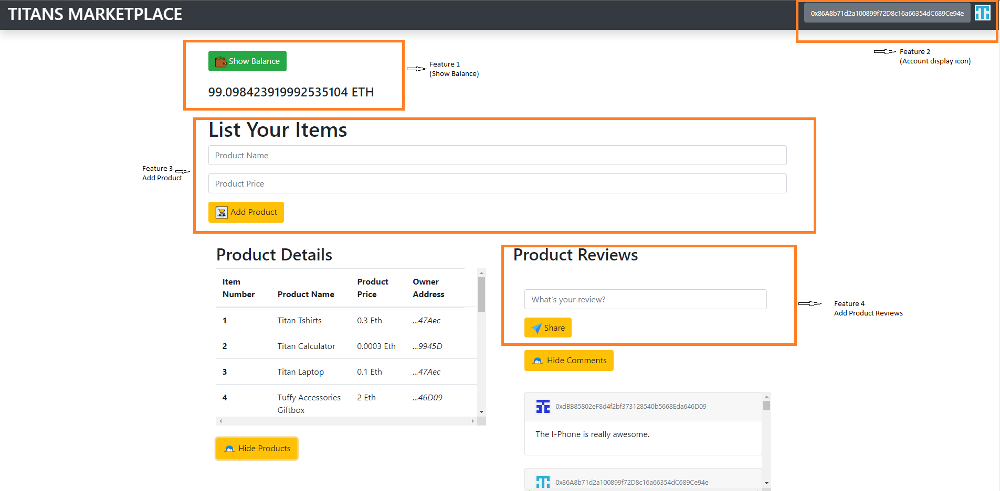
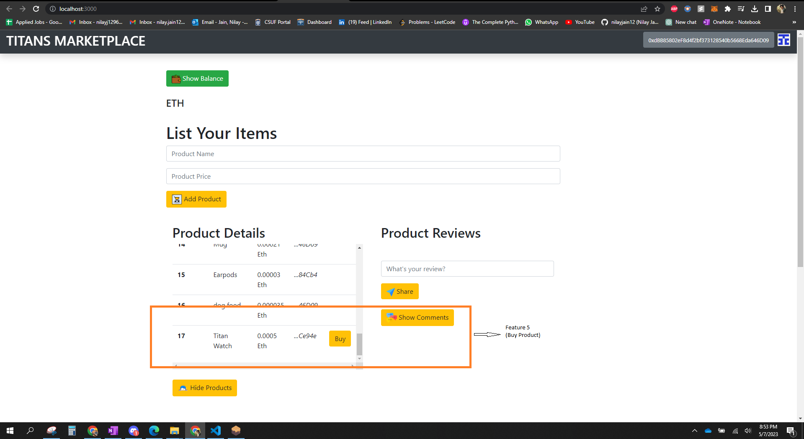
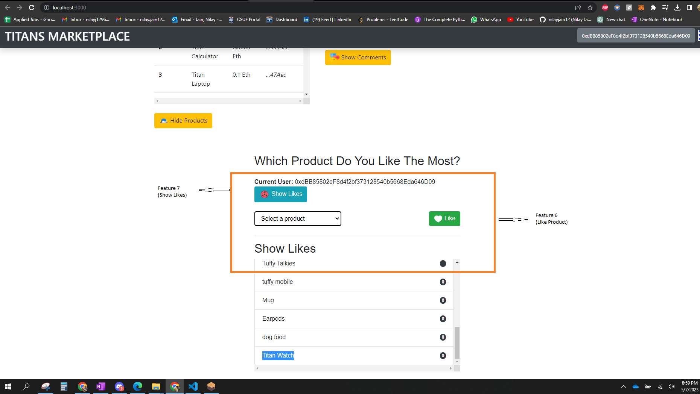
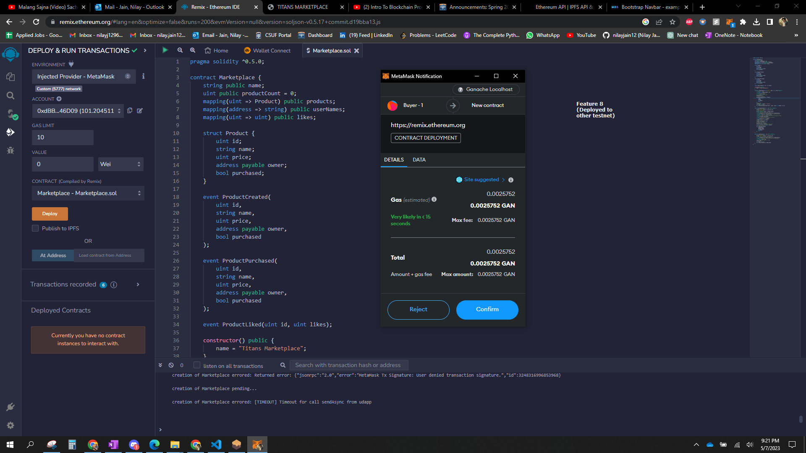

# **Titans Marketplace Web Application (DAPP) README**

## **Group Member Details:**
- Member 1: Nilay Jain (885189852) (njain12@csu.fullerton.edu)
- Member 2: Yathartha Patankar (885189803) (yatharthapatankar@csu.fullerton.edu)
- Member 3: Gayathri Nagulavancha(885211656)(gayathrirao234@csu.fullerton.edu)
- Member 4: Shravya Naragam (885451575)(s.naragam@csu.fullerton.edu)

## **Introduction:**
This project is a marketplace web application built using Solidity, Metamask, Ganache, and the React framework. The application provides users with a platform to buy and sell products in a decentralized manner, leveraging the power of blockchain technology with several additional functionalities.. 

## **Objective:**
The main objective of this project is to test the smart contracts and the DAPP in a local blockchain network, Ganache. Other objectives include:
- From sellers account, adding an item on marketplace and specifying its cost. 
- From buyers account, buying any listed item. 
- Checking the balance of the selected account.
- Adding the product reviews from any account.
- Changing the user's profile icon according to selected account address. 
- Liking any listed item.
- Seeing the Likes of product.
- Deploying it on other testnet. 
- And many more.

## **Prerequisites:**
To run this, you need to have the following installed:
- Ganache
- Metamask extension for your web browser
- Node.js
- Web3.js
- Solidity
- React
- Truffle Dependencies 

The Truffle network's RPC port is 7545.

## **Steps to Run:**
To run the project, you will need to do following steps:
- Open the project folder in VS code. 
- Install all the dependencies.
- Open and configure the Ganache localhost blockchain network. 
- Deploy and Migrate the smart contract.
- Make sure you have Metamask installed and logged in.
- Run the project on your desired port from terminal.

## **Installation:**
To install the project, follow these steps:

### **Using CMD:**
**Step 1:** Go to the package path and open cmd.

**Step 2:** Type the following command to install all the dependencies.
```npm install```

**Step 3:** Type the following command to install truffle library:
```npm install -g truffle```

**Step 4:** After installation, type the following command to compile the truffle files:
```truffle compile```

**Step 5:** To Run the project type the following command.
```npm run start```

**Step 6:** Open your browser and type "localhost:<port showing after running above step>"

## **Screenshots for References:**
Below are the screenshots of the web application with proper connectivity with the backend and Metamask:






## **Additional Information:**
The project can be further extended by adding more features and functionalities like creating a user profile, integrating with other blockchain networks, and many more. The possibilities are endless.